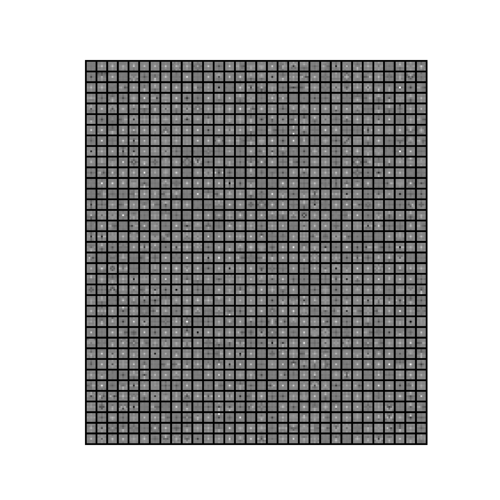

# Clinic-NET

Explainable Differential Diagnosis of Dementia using Self-supervised Learning.
The proposed method is based on Nearest-Neighbor Contrastive Learning of Visual
Representations (NNCLR) [1] using EfficientNET-B0 [2].

The following image visualizes the whole architecture:

## Repository structure:
- `data` folder is used to store or reference data
- `configuration` folder contains the YAML file for the configuration
- `data_processing` folder contains the methods that are used to prepare data for a model
- `models` folder defines a model structure
- Output will be saved into the folder `output`

## Datasets are accessible through http://adni.loni.usc.edu/, if not otherwise stated:
- (in use) ADNI. Alzheimer's Disease Neuroimaging Initiatve
- (in use) NIFD. Frontotemporal Lobar Degeneration
- (in use) AIBL. Australian Imaging, Biomarkers and Lifestyle
- (in use) OASIS. Access: https://www.oasis-brains.org/#data
- (planned) ABVIB. Aging Brain: Vasculature, Ischemia, and Behaviour
- (in use) PPMI. Parkinson's Progression Markers Initiative
- (planned) GCP. Brain Genomics Superstruct Project
- (planned) The A4 Study. Anti-Amyloid Treatment in Asymptomatic Alzheimer's
- (planned) MIRIAD, Access: https://www.ucl.ac.uk/drc/research/research-methods/minimal-interval-resonance-imaging-alzheimers-disease-miriad
- (planned) HABS, Access: will follow

See also /data_dzne_archiv2/Studien/ClinicNET/data/

## Set-up Instructions:
- `sudo apt-get install dcm2niix`
- install ANTs: https://github.com/ANTsX/ANTs/wiki/Compiling-ANTs-on-Linux-and-Mac-OS
- `pip3 install lightly openpyxl mlxtend zennit nibabel`
- `git clone https://github.com/VadymV/clinica` and `git clone https://github.com/VadymV/clinicadl.git`
- `pip install ./clinica ./clinicadl`
- download each dataset and place extracted image data into its own directory: 
/data/dataset_name/data/folder_with_extracted_data (e.g. /data/nifd/data/NIFD). 
Also download clinical data and place it into the clinical_data folder (e.g. /data/nifd/clinical_data). 
Of course, a symbolic link can be used instead of using the dataset directory directly (e.g. `ln -s source link`)
- folow the instructions on https://aramislab.paris.inria.fr/clinica/docs/public/latest/
how to use dataset converters: e.g. 
`clinica convert nifd-to-bids [OPTIONS] DATASET_DIRECTORY CLINICAL_DATA_DIRECTORY BIDS_DIRECTORY`
- run `clinica run t1-linear [OPTIONS] BIDS_DIRECTORY CAPS_DIRECTORY`
See also https://aramislab.paris.inria.fr/clinica/docs/public/latest/Pipelines/T1_Linear/
for more details
- extract 2D slices: 
`clinicadl extract slice CAPS_DIRECTORY t1-linear --slice_mode single --slice_direction 1 --discarded_slices 50`
- create a file that contains all required information about patients: `clinica iotools merge-tsv BIDS info_data.tsv`

## How to?
- When data are prepared the actual training of models and their evaluation can begin
- The file `info_data.tsv` is used as metadata (e.g. for data loading, split into train and test sets, creation of 
labels)
- Configurations are defined in the `configuration/configuration.yaml` file:
  - Block `data` contains settings on how to select slices and what labels to consider
  - `nnclr`, `linear_eval`, and `independent_linear_eval` blocks are used to set parameters for 
training/evaluation and load specific dataset
- Use `train_nnclr.py` to train the NNCLR model
- Use `train_linear_evaluation.py` to train a linear layer on top of the NNCLR model
- Use `eval_nnclr.py` to evaluate the whole model
- Do you want to use your own dataset? Extend the code in `clinica` and `clinicadl` libraries:
  1. Conversion to BIDS: see `clinica/clinica/iotools/converters` to imitate the same structure
  2. T1-pipeline: see `clinica/clinica/pipelines/t1_linear` if in some places additional references
  are needed, however the pipeline should not depend on additional information
  3. Extraction of slices: see `clinicadl/clinicadl/extract` if in some places additional references
  are needed, however the pipeline should not depend on additional information

## PPMI dataset
- Download imaging data through adni website. The process is similar to available datasets.
When the imaging data are added to collection, download the collection metadata in tabular form
(see instructions for the NIFD dataset)

## Additional info and known issues
- delete files: `find . -name '*pattern*' -exec rm {} \;`
- unzip files: `unzip "file_name*.zip" -d output_dir/`
- running out of storage place. Clinica uses tmp directory for intermediate calculations. 
If you want to provide another location, do: `export TEMP=/new_location/` or `export TMP=/new_location/` or 
`export TMPDIR=/new_location/` based on your settings
- clinicadl (version 1.0.3) requires clinica==0.4.1
- if `InvalidIndexError` occurs, insert (line 157):
    <pre>    
    
    if not merged_df.empty:
        merged_df = merged_df.append(row_df)
    else:
        merged_df = row_df.copy()
    
    </pre>

- if an error `ValueError: cannot reindex from a duplicate axis` occurs insert after line 167:
    <pre>
    merged_df = merged_df.reset_index(drop=True)
    merged_df = merged_df.loc[:, ~merged_df.columns.duplicated()]
    </pre>

- (NIFD) T1w MRI file for the subject sub-NIFD1S0017 with session ses-M00 does not exist and thus is removed
- PyCharm does not have enough space: set the variables idea.system.path=/path
idea.log.path=/data_dzne_archiv/Studien/ClinicNET/temp/log/
- `Warning: Assuming 7FE0,0010 refers to an icon not the main image`. 
This warning was ignored. Upgrade of dcm2niix did not help.
- `pandas.errors.ParserError: Expected 36 fields in line 80, saw 37`. This error occurs
while parsing the file 'aibl_flutemeta*.csv'. Fix: replace 'measured, AUSTIN AC AT Brain  H19s'
through 'measured AUSTIN AC AT Brain  H19s'.
- `File not found` error during the execution of the command ``xxxx-to-bids`.  To
overcome the termination of the process, type `continue` in a file `clinica -> utils -> inputs.py`
just before where the errors are collected: line 309 (08.02.2022, clinica=0.5.3)
- `dx1` is instead of `diagnosis` as a column name during processing of the OASIS dataset. 
Insert the following into the file `clinica/clinica/iotools/utils/data_handling.py` at the
appropriate places:

<pre>
            if 'dx1' in sessions_df.columns:
                sessions_df.rename(
                    columns={
                        "dx1": "diagnosis",
                    }, inplace=True,
                )
</pre>

## Current state
- NNCLR using 3 datasets: `ADNI3`, `NIFD`, `AIBL`
- Evaluation results:
  - `AD` vs `FTD`: MCC is 0.4990; Recall is 0.7551; Precision is 0.7440; Confusion matrix:
  
- Pre-trained NNCLR model: https://drive.google.com/file/d/1r76tJ6uLnhRIfho_2maPL7YsSsd3pYNx/view?usp=sharing
- Pre-trained NNCLR model + Top Linear layer: https://drive.google.com/file/d/1SgHFgna0SL2cbEW_N9hTTmpJoafJCwGD/view?usp=sharing

## Filter weights
Visualization of filters of the Conv2D layer from the 6th Mobile Inverted Bottleneck (https://paperswithcode.com/method/inverted-residual-block) and
1st sequential block with the non-default `groups` parameter (https://iksinc.online/2020/05/10/groups-parameter-of-the-convolution-layer/) : `Conv2d(192, 1152, kernel_size=(1, 1), stride=(1, 1), bias=False)`

## References:
[1] Dwibedi, D., Aytar, Y., Tompson, J., Sermanet, P., & Zisserman, A. (2021).
With a Little Help From My Friends: Nearest-Neighbor Contrastive Learning of Visual Representations.
<em> In Proceedings of the IEEE/CVF International Conference on Computer Vision (ICCV)</em>, 9588-9597.

[2] Mingxing Tan and Quoc V. Le (2019). EfficientNet: Rethinking Model Scaling for Convolutional Neural Networks.
<em>Proceedings of the 36th International Conference on Machine
Learning, Long Beach, California, PMLR 97</em>, 2019.
