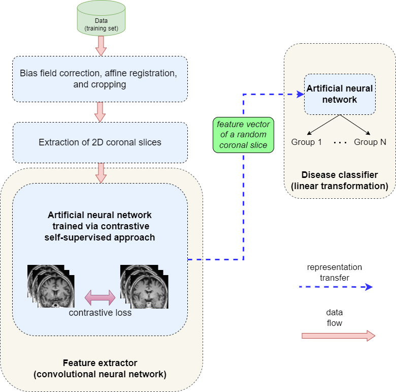
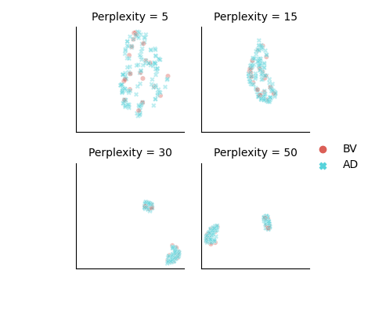
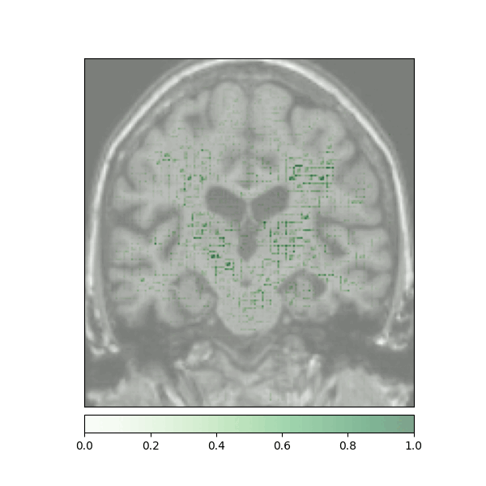
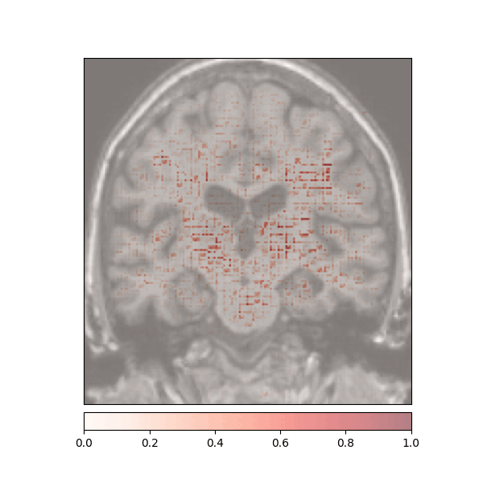
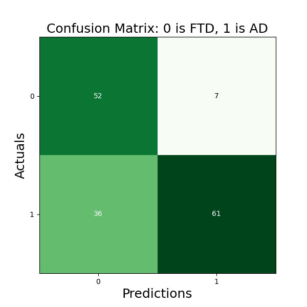

# Clinic-NET

Explainable Differential Diagnosis of Dementia using Self-supervised Learning.
The proposed method is based on Nearest-Neighbour Contrastive Learning of Visual
Representations (NNCLR) [1] using ConvNeXt Tiny [2] with 7x7 filter kernels.

The following image visualizes the whole architecture:

## Repository structure:
- `configuration` folder contains the YAML file for the configuration
- `data_processing` folder contains the methods that are used to prepare data for a model
- `models` folder defines a model structure
- `run_train_nnclr.py` trains the NNCLR model
- `run_train-classifier.py` trains the classification model
- `run_classifier_indep_eval.py` evaluates the whole model on independent data
- `run_classifier_evaluation.py` evaluates the whole model on the validation/test set
- `run_visual` creates figures
- All output information will be saved into the working folder (see `configuration.yaml`)

## Datasets are accessible through http://adni.loni.usc.edu/, if not otherwise stated:
- (in use) ADNI. Alzheimer's Disease Neuroimaging Initiatve
- (in use) NIFD. Frontotemporal Lobar Degeneration
- (in use) AIBL. Australian Imaging, Biomarkers and Lifestyle
- (in use) OASIS. Access: https://www.oasis-brains.org/#data
- (planned) ABVIB. Aging Brain: Vasculature, Ischemia, and Behaviour
- (in use) PPMI. Parkinson's Progression Markers Initiative
- (planned) GCP. Brain Genomics Superstruct Project
- (planned) The A4 Study. Anti-Amyloid Treatment in Asymptomatic Alzheimer's
- (planned) MIRIAD, Access: https://www.ucl.ac.uk/drc/research/research-methods/minimal-interval-resonance-imaging-alzheimers-disease-miriad
- (planned) HABS, Access: will follow

See also /data_dzne_archiv2/Studien/ClinicNET/data/

## Set-up Instructions & data preparations:
- `sudo apt-get install dcm2niix`
- install ANTs: https://github.com/ANTsX/ANTs/wiki/Compiling-ANTs-on-Linux-and-Mac-OS
- `pip3 install captum lightly openpyxl plotly mlxtend zennit nibabel torch_tb_profiler`
- `git clone https://github.com/VadymV/clinica` and `git clone https://github.com/VadymV/clinicadl.git`
- `pip install ./clinica ./clinicadl`
- `conda install tsnecuda -c conda-forge`
- download each dataset and place extracted image data into its own directory: 
/data/dataset_name/data/folder_with_extracted_data (e.g. /data/nifd/data/NIFD). 
Also download clinical data and place it into the clinical_data folder (e.g. /data/nifd/clinical_data). 
Of course, a symbolic link can be used instead of using the dataset directory directly (e.g. `ln -s source link`)
- follow the instructions on https://aramislab.paris.inria.fr/clinica/docs/public/latest/
how to use dataset converters: e.g. 
`clinica convert nifd-to-bids [OPTIONS] DATASET_DIRECTORY CLINICAL_DATA_DIRECTORY BIDS_DIRECTORY`.
- run `clinica run t1-linear [OPTIONS] BIDS_DIRECTORY CAPS_DIRECTORY`
See also https://aramislab.paris.inria.fr/clinica/docs/public/latest/Pipelines/T1_Linear/
for more details
- extract 2D slices: 
`clinicadl extract slice CAPS_DIRECTORY t1-linear --slice_mode single --slice_direction 1 --discarded_slices 50`
- create a file that contains all required information about patients: `clinica iotools merge-tsv BIDS info_data.tsv`

## How to?
- When data are prepared the actual training of models and their evaluation can begin
- The file `info_data.tsv` is used as metadata (e.g. for data loading, split into train and test sets, creation of 
labels)
- Configurations are defined in the `configuration/configuration.yaml` file:
  - Block `data` contains settings on how to select slices and what labels to consider
  - `nnclr`, `classifier`, and `independent_evaluation` blocks are used to set parameters for 
training/evaluation and load specific dataset
- Do you want to use your own dataset? Extend the code in `clinica` and `clinicadl` libraries:
  1. Conversion to BIDS: see `clinica/clinica/iotools/converters` to imitate the same structure
  2. T1-pipeline: see `clinica/clinica/pipelines/t1_linear` if in some places additional references
  are needed, however the pipeline should not depend on additional information
  3. Extraction of slices: see `clinicadl/clinicadl/extract` if in some places additional references
  are needed, however the pipeline should not depend on additional information

## Current state and results
- NNCLR training: `ADNI3`, `ADNI2`, `NIFD`
- Classifier training: `ADNI3`, `ADNI2`, `NIFD`
- Training trials: 3 (each trial new train and test sets are created that are the same for NNCLR and classifier models)
- Independent evaluation: `AIBL`
- Sample statistics of ADNI3 (N=2365, Patients=844):

|           |  CN       | AD         |  MCI        |
|-----------|-----------|------------|-------------|
| Age       |73.99(7)   |76.96(8.31) |74.57(7.97)  |   
| MMSE      |29.38(0.73)|20.84(4.50) |27.85(1.10)  |
| Sex: F/M  |312/221    |52/70       |140/173      |

- Sample statistics of ADNI2 (N=1836, Patients=743):

|           |  CN       | AD         |  MCI        |
|-----------|-----------|------------|-------------|
| Age       |75.75(7.02)|76.22(7.63) |74.57(7.86)  |   
| MMSE      |29.31(0.74)|21.07(4.29) |27.75(1.12)  |
| Sex: F/M  |110/94     |120/163     |151/203      |

- Sample statistics of AIBL (N=991, Patients=583):

|           |  CN       | AD         |  MCI        |
|-----------|-----------|------------|-------------|
| Age       |73.51(6.41)|75.39(7.86) |76.62(6.52)  |   
| MMSE      |29.20(0.77)|19.45(5.57) |27.17(1.25)  |
| Sex: F/M  |239/182    |51/37       |41/62        |

- Sample statistics of NIFD (N=614, Patients=273):

|           |  CN       | BV         |  SV         |  PNFA       |
|-----------|-----------|------------|-------------|-------------|
| Age       |64.29(7.05)|62.09(5.82) |62.72(6.80)  |68.94(7.72)  | 
| MMSE      |29.68(0.47)|22.56(6.22) |22.48(5.74)  |24.92(5.50)  |
| Sex: F/M  |72/58      |23/48       |14/23        |19/16

- Sample statistics of OASIS: N=2012, Patients=1079:
- Sample statistics of OASIS: N=1411, Patients=835:

- NNCLR training:
  - 1,000 epochs
  - a batch size of 180
  - nearest neighbour size: 8192
  - ConvNeXt Tiny CNN model with 7x7 filter kernel
  - data preparation for each sample:
    - a random slice across coronal plane within the middle region of the brain is selected
  - random transformations `t` are applied sequentially with `p(t)=0.5` to get 2 views of the same sample:
    - resized crop
    - erasing
    - horizontal flip

- Training of a classifier:
  - ConvNeXt Tiny CNN model serves as a feature extractor and is not trained
  - 100 epochs
  - a batch size of 64
  - features dimension from ConvNeXt Tiny CNN model: 768
  - classifier block that is trained: normalisation layer, flat operation, linear layer

- Feature maps of 22 convolutional layers (subject ADNI002S0729 diagnosed with AD, session M60):

- t-SNE visualisation of features learned by NNCLR (train set):

- Attributions created using Integrated Gradients of a patient diagnosed with Alzheimer's Disease: green (positive atttributions), red (negative attributions)

 |  

- Evaluation results:
  - `CN` vs `AD` vs `BV` vs `MCI` over 3 learning trials using test sets of ADNI3, ADNI2, NIFD: 
    - MCC is 0.32+/-0.01
    
  - `CN` vs `AD` using the independent dataset AIBL: 
    - MCC is 0.58+/-0.01 
    
## References:
[1] Dwibedi, D., Aytar, Y., Tompson, J., Sermanet, P., & Zisserman, A. (2021).
With a Little Help From My Friends: Nearest-Neighbor Contrastive Learning of Visual Representations.
<em> In Proceedings of the IEEE/CVF International Conference on Computer Vision (ICCV)</em>, 9588-9597.

[2] Liu, Z., Mao, H., Wu, C.Y., Feichtenhofer, C., Darrell, T., & Xie, S.. (2022). A ConvNet for the 2020s. 

------------------------------------------------------------------------------------------------------------------------
## Additional info and known issues
- delete files: `find . -name '*pattern*' -exec rm {} \;`
- unzip files: `unzip "file_name*.zip" -d output_dir/`
- running out of storage place. Clinica uses tmp directory for intermediate calculations. 
If you want to provide another location, do: `export TEMP=/new_location/` or `export TMP=/new_location/` or 
`export TMPDIR=/new_location/` based on your settings
- clinicadl (version 1.0.3) requires clinica==0.4.1
- if `InvalidIndexError` occurs, insert (line 157):
    <pre>    
    
    if not merged_df.empty:
        merged_df = merged_df.append(row_df)
    else:
        merged_df = row_df.copy()
    
    </pre>

- if an error `ValueError: cannot reindex from a duplicate axis` occurs insert after line 167:
    <pre>
    merged_df = merged_df.reset_index(drop=True)
    merged_df = merged_df.loc[:, ~merged_df.columns.duplicated()]
    </pre>

- (NIFD) T1w MRI file for the subject sub-NIFD1S0017 with session ses-M00 does not exist and thus is removed
- PyCharm does not have enough space: set the variables idea.system.path=/path
idea.log.path=/data_dzne_archiv/Studien/ClinicNET/temp/log/
- `Warning: Assuming 7FE0,0010 refers to an icon not the main image`. 
This warning was ignored. Upgrade of dcm2niix did not help.
- `pandas.errors.ParserError: Expected 36 fields in line 80, saw 37`. This error occurs
while parsing the file 'aibl_flutemeta*.csv'. Fix: replace 'measured, AUSTIN AC AT Brain  H19s'
through 'measured AUSTIN AC AT Brain  H19s'.
- `File not found` error during the execution of the command ``xxxx-to-bids`.  To
overcome the termination of the process, type `continue` in a file `clinica -> utils -> inputs.py`
just before where the errors are collected: line 309 (08.02.2022, clinica=0.5.3)
- `dx1` is instead of `diagnosis` as a column name during processing of the OASIS dataset. 
Insert the following into the file `clinica/clinica/iotools/utils/data_handling.py` at the
appropriate places:

<pre>
            if 'dx1' in sessions_df.columns:
                sessions_df.rename(
                    columns={
                        "dx1": "diagnosis",
                    }, inplace=True,
                )
</pre>

